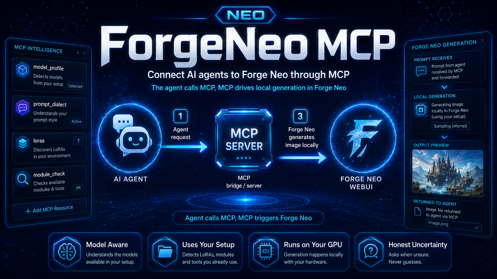

<div align="center">
  
</div>

# 🌉 Forge Neo MCP

<div align="center">

[](https://github.com/Haoming02/sd-webui-forge-classic/tree/neo)
[](https://modelcontextprotocol.io)
[](https://www.python.org/)
[](https://github.com/eduardoabreu81/forgeneo-mcp)
[](LICENSE)

> **MCP server for [Stable Diffusion WebUI Forge - Neo](https://github.com/Haoming02/sd-webui-forge-classic/tree/neo)** · Generate images on your own GPU, from any AI agent that speaks MCP

</div>

Ask Claude — or any MCP-capable agent — for an image, and it generates on your local Forge Neo. It reads which checkpoint is loaded, works out the sampling parameters and prompt style that model expects, writes the prompt, and hands you back the file.

You never have to dictate steps, CFG or sampler unless you want to. Those come from your own setup: your instance's settings, your past generations, your checkpoint's metadata. Where something cannot be determined, it asks instead of guessing.

> [!IMPORTANT]
> Forge Neo must run with `--api`. Nothing is installed into your Forge folder — no extension, no custom node. The bridge talks to the REST API that Forge already exposes.

---

## 📋 Table of Contents

- [Requirements](#-requirements)
- [Installation](#-installation)
- [Configuration](#-configuration)
- [First run](#-first-run)
- [Using it](#-using-it)
- [Tools](#-tools)
- [Troubleshooting](#-troubleshooting)
- [What it does for you](#-what-it-does-for-you)
- [Roadmap](#-roadmap)
- [Credits](#-credits)

---

## ✅ Requirements

| | |
|---|---|
| **Forge Neo** | running with `--api` |
| **Python** | 3.10 or newer, on the machine running the agent |
| **An MCP client** | Claude Code, Claude Desktop, Cursor, or anything else that speaks MCP |

Only if Forge runs on a different machine: network access to it, and a file share if you want results as file paths rather than base64.

---

## 📦 Installation

### 1 · Turn on the API in Forge Neo

Edit your `webui-user.bat` (Windows) or `webui-user.sh` (Linux) and add `--api`:

```bat
set COMMANDLINE_ARGS=--api
```

Keep whatever flags you already had — just append `--api`. Restart Forge.

> **Check it worked:** open `http://127.0.0.1:7860/docs`. If you see `/sdapi/v1/...` endpoints listed, the API is on.

### 2 · Install the bridge

```bash
pip install git+https://github.com/eduardoabreu81/forgeneo-mcp
```

### 3 · Register it with your agent

**Claude Code**

```bash
claude mcp add forgeneo -e FORGE_URL=http://127.0.0.1:7860 -- forgeneo-mcp
```

**Claude Desktop, Cursor, or any client with an `mcp.json`**

```json
{
  "mcpServers": {
    "forgeneo": {
      "command": "forgeneo-mcp",
      "env": { "FORGE_URL": "http://127.0.0.1:7860" }
    }
  }
}
```

Restart your client — MCP servers load at startup, so the tools appear in a new session.

---

## ⚙️ Configuration

Everything is optional except `FORGE_URL`, and even that only if Forge is not at `127.0.0.1:7860`.

| Variable | What it does | Default |
|---|---|---|
| `FORGE_URL` | Where Forge is | `http://127.0.0.1:7860` |
| `FORGE_AUTH` | `user:password`, if you started Forge with `--api-auth` | none |
| `FORGE_PATH_MAP` | Translates Forge's paths into ones your machine can reach | none |
| `FORGE_OUTPUT_DIR` | Your output folder, if it cannot be found automatically | auto |
| `FORGE_TIMEOUT` | Seconds to wait on a request | `600` |
| `FORGE_HISTORY_LIMIT` | How many recent images to read when learning your settings | `600` |
| `FORGE_CIVITAI_LOOKUP` | `1` allows identifying a checkpoint by hash online | off |
| `FORGENEO_CACHE_DIR` | Where your confirmed answers are remembered | `~/.forgeneo-mcp` |

### Everything on one machine

Nothing else to do — the defaults cover it.

### Forge on another machine

Start Forge with `--listen --api`, then point the bridge at it and map its paths:

```bash
claude mcp add forgeneo \
  -e FORGE_URL=http://gpu-box:7860 \
  -e FORGE_PATH_MAP='D:/forge-neo=//gpu-box/share/forge-neo' \
  -- forgeneo-mcp
```

`FORGE_PATH_MAP` reads as **what Forge calls it** = **what you call it**. Forge reports paths like `D:\forge-neo\output\...`; if you reach that same folder as `\\gpu-box\share\forge-neo\output\...`, that mapping lets the bridge hand you file paths instead of megabytes of base64.

Without it everything still works — you just get base64.

> [!NOTE]
> `--listen` exposes the API to your network with no password. If that matters where you are, add `--api-auth user:password` to Forge and set `FORGE_AUTH` to match.

---

## 🚀 First run

Open a new session and ask your agent to check the connection. It calls `capabilities` and reports what it found:

```
reachable    true
counts       checkpoints · loras · samplers · schedulers · modules
filesystem   file paths        (or: base64 — no readable output dir)
history      how many past generations it could read
```

Three things worth a glance:

- **`filesystem: base64`** — `FORGE_PATH_MAP` is missing or wrong. Not fatal, but results will bloat your conversation.
- **`history: 0`** — it cannot learn from your past work. Usually the output folder is unreachable, or Forge is saving no metadata (see [Troubleshooting](#-troubleshooting)).
- **`loras: 0`** with LoRAs installed — Forge's own LoRA list is empty; refresh it in the UI.

---

## 💬 Using it

Just ask. The agent handles the rest.

> **"a cover image for a post about winter hiking"**
>
> It checks what is loaded, sees whether that model wants prose or tags, writes the prompt accordingly, and generates.

> **"same thing but in the style I use for thumbnails"**
>
> It searches your LoRAs, finds the one you mean, picks up its trigger word and the weight you normally use, and writes it into the prompt — visibly, so you can read what was sent.

> **"switch to my portrait model"**
>
> It loads that checkpoint. If it belongs to a different architecture, the matching VAE and text encoder come with it.

Other things worth asking directly:

- *"what model is loaded and how should I prompt it?"* — the profile, in plain terms
- *"which of my LoRAs work with this checkpoint?"* — filtered to compatible ones
- *"is my flux setup complete?"* — checks the VAE and text encoders
- *"stop"* — interrupts a running generation

---

## 🛠️ Tools

Your agent picks these on its own; the list is here so you know what it can do.

| Tool | Purpose |
|---|---|
| `capabilities` | What this instance offers and what the bridge could read |
| `model_profile` | The loaded checkpoint: parameters, prompt style, module health |
| `prompt_dialect` | How this model expects to be prompted, with its quality tags |
| `loras` | Search your LoRAs by name, tag, trigger word or description |
| `lora_info` | Everything about one LoRA, with a ready prompt fragment |
| `models` | List, load or refresh checkpoints |
| `module_check` | Whether the loaded VAE and text encoders suit the architecture |
| `module_download` | Where a missing module comes from — fetches only if you approve |
| `generate` | Generate from a written prompt, txt2img or img2img |
| `progress` | Check, interrupt or skip the running job |

---

## 🔧 Troubleshooting

**It says it cannot reach Forge**
Confirm Forge is running with `--api` and that `http://127.0.0.1:7860/docs` lists `/sdapi/v1/` endpoints. If Forge is on another machine it also needs `--listen`, and a firewall may be in the way.

**Results come back as base64 and flood the conversation**
`FORGE_PATH_MAP` is missing or does not match. Compare the path Forge reports — visible in any generation's info — with the path you use to reach the same folder.

**It does not know my usual settings**
It learns from your past images, which needs Forge to save generation parameters. In *Settings → Saving images*, keep **"Save text information about generation parameters as chunks to png files"** enabled, or turn on the `.txt` sidecar. With neither, your outputs carry no parameters and it falls back to architecture defaults.

**It keeps asking which lineage my SDXL checkpoint is**
Pony, Illustrious, Animagine and stock SDXL are indistinguishable from the file — same tensors, same preset, different prompt vocabulary. Answer once; it is remembered per file and never asked again.

**Images look wrong after switching architecture**
Ask for a module check. Forge remembers the last VAE and text encoder selected under each preset, so loading a checkpoint while another preset was active can leave the wrong ones attached. The check names what is missing and whether the right file is already installed.

**A download was refused for lack of space**
Deliberate — it checks free space before starting rather than failing several gigabytes in. Free some room, or pick a lighter build such as `fp8_scaled` instead of `bf16`.

---

## 🎯 What it does for you

- **Sampling parameters that fit the model.** Taken from your own past generations where available, and from your instance's settings otherwise — not from a table in this repo.
- **The right prompt vocabulary.** Quality tags where they help, none where they hurt: adding `masterpiece, best quality` to a model trained on captions dilutes the prompt rather than improving it.
- **Your LoRAs, searchable.** By name, tag, trigger word or description, with the weights you actually use. Nothing is added to a prompt without showing you.
- **Honest uncertainty.** Where the evidence runs out it says so and asks. No silent guesses.
- **Module sanity checks.** Notices when a preset has picked up the wrong VAE or text encoder, and points at the official download for anything missing.

Notes on how each answer is derived live in the source, next to the code that derives it.

---

## 🗺️ Roadmap

- **Video (Wan)** — Forge generates video through frame counts in multiples of `4n+1` and encodes with ffmpeg, but the API discards the resulting path. Collecting from disk is already how images come back, so this is mostly plumbing.
- **EXIF metadata** — JPEG and WebP store parameters in EXIF when the `.txt` sidecar is off; that combination currently yields no history.
- **Authentication** — `FORGE_AUTH` is implemented but has not been exercised against a live `--api-auth` instance.

---

## 📄 Credits

- **[Forge Neo](https://github.com/Haoming02/sd-webui-forge-classic/tree/neo)** by Haoming02 — the WebUI this bridges to, and the [Download Models](https://github.com/Haoming02/sd-webui-forge-classic/wiki/Download-Models) wiki behind the module reference
- **Model authors** who publish real prompting guidance on their cards — the dialect table is built from those, not from guesswork
- **[Model Context Protocol](https://modelcontextprotocol.io)** — the protocol and Python SDK
- **[CivitAI](https://civitai.com)** — public by-hash endpoint used by the optional lookup

---

## 📜 License

MIT — see [LICENSE](LICENSE)

---

<div align="center">

Made with ❤️ for the Stable Diffusion community

**[Report Bug](https://github.com/eduardoabreu81/forgeneo-mcp/issues)** • **[Request Feature](https://github.com/eduardoabreu81/forgeneo-mcp/issues)** • **[Discussions](https://github.com/eduardoabreu81/forgeneo-mcp/discussions)** • **[☕ Ko-fi](https://ko-fi.com/eduardoabreu81)**

</div>
